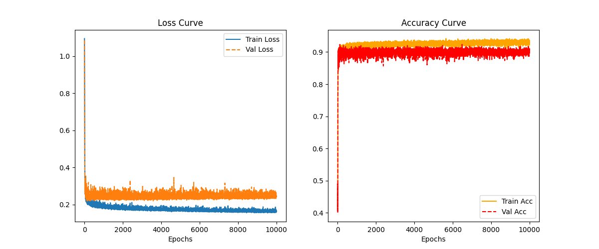
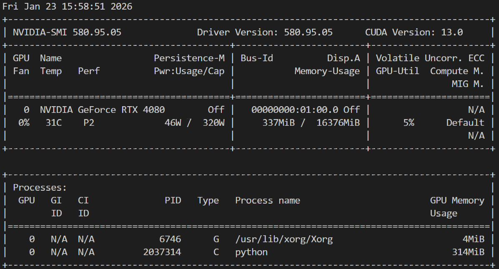

# 🧱 Project 01: MLP Base for Multi-Class Classification

## Task

Simulated data from Package [nnfs](https://github.com/Sentdex/nnfs):

Using function `spiral_data` of nnfs, we generated a 3-class data, each class has 500 samples.

The spiral_data function generates data points that form a spiral pattern.

```python
samples = 500
classes = 3
X, Y = spiral_data(samples=samples, classes=classes)
```

Each sample (data point) here is represented by a pair of (x,y),

x: a 1D NumPy array, shape of (2,), coordinates of this point in the spiral pattern in a 2-dimensional space.

y: a uint8 value, class label of the corresponding data point in x, integers starting from 0.

SO our task here is very simple, we generated a 3-class data, each class has 500 samples,

we train the simple MLP here to let it learn how to predict a data point's label from its 2D coordinates (2 features).

For the educational demonstration, we configure the hidden layer dimensions of the Multi-Layer Perceptron (MLP) as [64, 128, 32] in this setup. You can change it dynamically.

## 🚀 Getting Started

### 1. Installation
Clone the repo and install dependencies (Standard PyTorch stack).

```text
# basic requirements
pyyaml>=6.0.3
nnfs>=0.5.1
torch-2.9.1+cu130
numpy>=2.2.2
matplotlib>=3.10.0
```

### 2. Run Training

```text
Model structure:
UniversalMLP(
  (network): Sequential(
    (0): Linear(in_features=2, out_features=64, bias=True)
    (1): ReLU()
    (2): Linear(in_features=64, out_features=128, bias=True)
    (3): ReLU()
    (4): Linear(in_features=128, out_features=32, bias=True)
    (5): ReLU()
    (6): Linear(in_features=32, out_features=3, bias=True)
  )
```

The entry point is `main.py`. It automatically loads the default config.

```python
python main.py  --help
usage: main.py [-h] [--config CONFIG]

A very simple PyTorch Neural Network Project

options:
  -h, --help       show this help message and exit
  --config CONFIG  Path to config file
```

```bash
python main.py --config configs/config.yaml
```

**What happens next?**
1.  Logs appear in console and `training.log`.

    [training.log](./training.log)

2.  Models are saved in `checkpoints/` (`best_model.pth`, `last_model.pth`).

    [models](./checkpoints/)

3.  Training visualization is saved as `checkpoints/training_curve.png`.

    

---





### 3, Run prediction

如果我们不想依赖predict.py, 而是想在独立的测试脚本或Notebook单元中加载最好的model权重进行单元测试, 我们就需要做以下三件事:

* 实例化模型架构(必须和训练时的参数一模一样, 详情参考yaml配置文件) 
* 加载权重文件(用训练时最好的权重文件, 处理state_dict)
* 进入评估模式(eval)

```python
import torch
import sys
import os
import nnfs
from nnfs.datasets import spiral_data
import numpy as np

# ---------------------------------------------------------
# 1. 确保能导入 src 模块
# 就是需要将我们模型构建所依赖的各种脚本文件都加入到python路径中, 
# 或者可以通过python路径去相对访问, 那一般就是sys.path.append
# ---------------------------------------------------------
current_dir = "/mnt/sdb/zht/MLP_1" # 假设current_dir是我们model所在的文件目录
if current_dir not in sys.path:
    sys.path.append(current_dir)

from src.model import UniversalMLP  # 导入模型定义

# ---------------------------------------------------------
# 2. 实例化模型架构
# ⚠️ 关键点：这里的参数必须与我们 config.yaml 中训练时的参数完全一致！
# ---------------------------------------------------------
# 假设我们在 config.yaml 里是这样配置的 (也就是前面训练时的实际情况):
model_params = {
    "input_dim": 2,          # 输入特征维度
    "hidden_dims": [64, 128, 32], # 隐藏层结构
    "output_dim": 3,         # 输出类别数
    "activation": 'relu'     # 激活函数
}

# 初始化一个"空壳"模型
model = UniversalMLP(**model_params)

# ---------------------------------------------------------
# 3. 加载权重 (Best Weights)
# ---------------------------------------------------------
checkpoint_path = '/mnt/sdb/zht/MLP_1/checkpoints/best_model.pth'  # 最好权重的路径
device = torch.device("cuda" if torch.cuda.is_available() else "cpu")

if os.path.exists(checkpoint_path):
    print(f"Loading weights from {checkpoint_path}...")
    
    # 加载 checkpoint 字典
    checkpoint = torch.load(checkpoint_path, map_location=device)
    
    # ⚠️ 注意: 我们的 Trainer 保存的是一个包含多个信息的字典
    # 通常 key 是 'model_state_dict' 或 'state_dict'
    if 'model_state_dict' in checkpoint:
        model.load_state_dict(checkpoint['model_state_dict'])
        
    print("✅ Model loaded successfully!")
else:
    print(f"❌ Error: Checkpoint not found at {checkpoint_path}")

# ---------------------------------------------------------
# 4. 预测 (Inference)
# ---------------------------------------------------------
model.to(device)
model.eval() # ⚠️ 极其重要: 关闭 Dropout 和 BatchNrom 的训练行为

# 构造一个虚假数据样本用来测试 
x_test, y_test = spiral_data(samples=100, classes=3)
x_test = torch.tensor(x_test, dtype=torch.float32).to(device)
y_test = torch.tensor(y_test, dtype=torch.long).to(device)

with torch.no_grad(): # ⚠️ 极其重要: 不计算梯度，节省显存并加速
    logits = model(x_test)
    probs = torch.softmax(logits, dim=1)
    # 单个样本预测可以用.items()
    predicted_classes = torch.argmax(probs, dim=1)
    # 多个样本预测, 其实就是批量输出, 必须得先转换为numpy数组
    logits_np = logits.cpu().numpy()
    probs_np = logits.cpu().numpy()
    predicted_classes_np = predicted_classes.cpu().numpy()
    # 前面是先将y_test转换为tensor再迁移到gpu上, 现在反过来先从gpu迁移到cpu上再从tensor转换为numpy的ndarray
    y_test_np = y_test.cpu().numpy()

print(f"\n🔮 Prediction Results:")
print(f"Logits: {logits_np}")
print(f"Probabilities: {probs_np}")
print(f"Predicted Class: {predicted_classes_np}")
print(f"accuracy {np.mean(predicted_classes_np == y_test_np)}")

```

below shows the log

```text
Loading weights from /mnt/sdb/zht/MLP_1/checkpoints/best_model.pth...
✅ Model loaded successfully!

🔮 Prediction Results:
Logits: [[ 4.52351511e-01  1.49889791e+00  1.46372998e+00]
 [ 1.08856618e+00  4.67490107e-01  1.69749224e+00]
 [ 1.18739355e+00  1.59494078e+00  8.22763383e-01]
 [ 2.46827960e+00 -7.40973115e-01  1.47406542e+00]
 [ 2.69478202e+00 -2.07980704e+00  2.13190722e+00]
 [ 3.38884640e+00 -1.03248656e+00  9.25970197e-01]
 [ 4.09621763e+00 -3.11275744e+00  1.63842881e+00]
 [ 4.44461346e+00 -3.17493868e+00  1.38503683e+00]
 [ 4.04678059e+00 -3.99410129e+00  2.06802273e+00]
 [ 5.03763962e+00 -4.17800093e+00  1.35946786e+00]
 [ 4.11122561e+00 -4.39378309e+00  2.13908291e+00]
 [ 5.38333416e+00 -4.57396889e+00  1.13111579e+00]
 [ 1.20725739e+00 -2.81906962e+00  3.42902684e+00]
 [ 1.94070971e+00 -3.24849963e+00  3.03889656e+00]
 [ 4.62167072e+00 -3.42349792e+00  5.27404189e-01]
 [ 4.72080708e+00 -5.00758362e+00  1.61491263e+00]
 [ 4.65673256e+00 -3.48054147e+00  2.79185653e-01]
 [ 1.08844173e+00 -4.03406715e+00  3.64350867e+00]
 [ 2.80453300e+00 -3.79985523e+00  1.80732381e+00]
 [ 2.59935570e+00 -4.18297625e+00  1.92610061e+00]
 [ 2.63846445e+00 -4.53138399e+00  1.92873275e+00]
 [ 2.61718488e+00 -4.56651258e+00  2.06153440e+00]
 [ 3.49323010e+00 -4.09079695e+00  7.64917314e-01]
 [ 2.95823979e+00 -4.30313158e+00  1.67419875e+00]
 [ 3.65471387e+00 -5.17023420e+00  8.75650585e-01]
 [ 2.04046893e+00 -3.11463809e+00  1.92975533e+00]
 [ 3.79771137e+00 -4.52706718e+00  4.78996962e-01]
 [ 2.56937432e+00 -2.22502995e+00 -6.72433436e-01]
 [ 1.99412572e+00 -2.45882082e+00  1.44290102e+00]
 [ 3.86895084e+00 -3.62600470e+00  5.87489128e-01]
 [ 3.44849586e+00 -3.38407230e+00 -5.03899038e-01]
 [ 3.67722297e+00 -3.22353625e+00  7.30506182e-01]
 [ 4.31664562e+00 -3.35316038e+00  7.46577904e-02]
 [ 3.00859809e+00 -2.19003487e+00  4.16441172e-01]
 [ 2.75174499e+00 -1.85193264e+00  2.89934754e-01]
 [ 2.86475945e+00 -1.81718230e+00  1.32225007e-01]
 [ 2.90754032e+00 -3.95653486e+00  1.46026719e+00]
 [ 2.46133065e+00 -5.40489244e+00  2.97617817e+00]
 [ 3.35938787e+00 -1.83643460e+00 -3.50455821e-01]
 [ 3.46472597e+00 -1.52786827e+00 -7.21119821e-01]
 [ 3.11896944e+00 -1.04504859e+00 -7.32860386e-01]
 [ 2.75554037e+00 -5.71023703e-01 -9.37842667e-01]
 [ 4.34821463e+00 -4.91322279e+00  8.32542777e-01]
 [ 4.35839510e+00 -4.14298391e+00  1.76381409e-01]
 [ 1.94961751e+00  2.34720245e-01 -1.20413947e+00]
 [ 4.72956800e+00 -4.57021999e+00  2.95355499e-01]
 [ 2.65338922e+00 -4.70943022e+00  1.46172321e+00]
 [ 1.00059772e+00 -4.48669720e+00  1.39547288e+00]
 [ 1.81745374e+00 -3.92433357e+00  1.07778585e+00]
 [ 3.87445426e+00 -4.60551214e+00  8.66895974e-01]
 [-7.57624567e-01 -4.70307922e+00  2.01638579e+00]
 [ 1.63739526e+00 -4.88045835e+00  7.12700188e-01]
 [ 2.32734728e+00 -3.12858558e+00  3.02892923e-01]
 [ 2.09063005e+00 -2.59976792e+00  1.15764074e-01]
 [ 1.06745541e+00 -4.41292906e+00  5.03911197e-01]
 [ 2.63384414e+00 -3.86946487e+00 -2.70352125e-01]
 [ 9.98763025e-01 -4.63757801e+00  6.29142046e-01]
 [ 1.53182423e+00 -4.28991890e+00 -7.44349509e-03]
 [ 7.85938740e-01 -5.67761469e+00  4.85660657e-02]
 [ 1.57740796e+00 -5.68004370e+00 -4.23587620e-01]
 [ 1.40012443e+00 -5.59775782e+00 -4.64748085e-01]
 [ 2.53573942e+00 -3.34104013e+00 -1.37022746e+00]
 [ 2.52874017e+00 -3.50878048e+00 -1.48413777e+00]
 [ 2.59593368e+00 -4.89434719e+00 -1.00140488e+00]
 [ 1.57144129e-01 -5.23415375e+00  4.01648313e-01]
 [-5.06961644e-01 -5.62127924e+00  2.42408442e+00]
 [ 4.31762397e-01 -5.22700787e+00  2.84781724e-01]
 [ 1.26536298e+00 -4.29012537e+00 -1.53275299e+00]
 [ 1.78766096e+00 -4.13542318e+00 -2.06861806e+00]
 [ 1.36166358e+00 -4.15922832e+00 -1.82984924e+00]
 [ 1.47677672e+00 -4.61170816e+00 -1.23120379e+00]
 [ 1.42453492e+00 -2.42630029e+00 -2.44457746e+00]
 [ 1.98474538e+00 -4.25328970e+00 -2.09224057e+00]
 [ 1.67890036e+00 -5.00849962e+00 -4.81143117e-01]
 [ 1.09122741e+00 -4.26856232e+00  3.22040820e+00]
 [ 1.66209233e+00 -4.61804914e+00 -4.49250162e-01]
 [ 2.32056069e+00 -5.49357319e+00  3.14673305e+00]
 [ 1.73337066e+00 -4.90645409e+00  2.33977246e+00]
 [ 2.84092546e+00 -5.94803524e+00  2.68892550e+00]
 [ 2.92193079e+00 -5.87425518e+00  2.51324773e+00]
 [ 4.26701880e+00 -7.30552626e+00  3.83995438e+00]
 [ 4.92899990e+00 -7.95653296e+00  3.46299553e+00]
 [ 2.02912974e+00 -3.16790462e+00  5.19392538e+00]
 [ 1.47596931e+00 -1.85885656e+00 -2.22447753e+00]
 [ 5.66097641e+00 -8.22055340e+00  5.23673439e+00]
 [ 6.51181841e+00 -9.33970070e+00  4.73655176e+00]
 [ 7.22239351e+00 -9.88569927e+00  3.47081590e+00]
 [ 7.30891037e+00 -9.93283939e+00  5.37777090e+00]
 [ 6.83545399e+00 -8.78533459e+00  5.64155865e+00]
 [ 5.37961674e+00 -6.91539192e+00  1.62230504e+00]
 [ 8.75644779e+00 -1.12813559e+01  5.66087103e+00]
 [ 6.01165342e+00 -7.30619526e+00  6.26502752e+00]
 [ 9.18918800e+00 -1.08834124e+01  6.03340435e+00]
 [ 5.36239052e+00 -6.63673353e+00  5.67202234e+00]
 [ 1.00326929e+01 -1.20592709e+01  6.14581394e+00]
 [ 9.70687580e+00 -1.16377916e+01  3.04213595e+00]
 [ 1.83847582e+00 -3.33849025e+00  3.68374515e+00]
 [ 3.58141541e+00 -4.75871277e+00  4.72533703e+00]
 [ 8.51051617e+00 -9.95613194e+00  6.81101847e+00]
 [ 1.06310301e+01 -1.20964136e+01  7.21933270e+00]
 [ 4.52351511e-01  1.49889791e+00  1.46372998e+00]
 [-2.36699641e-01  2.36700916e+00  1.38667643e+00]
 [-8.04615557e-01  3.57425642e+00  9.75264549e-01]
 [-1.00392520e+00  4.49310923e+00  4.80623335e-01]
 [-1.25285232e+00  5.25311708e+00  1.37071788e-01]
 [-7.46549428e-01  5.37837648e+00 -3.45648915e-01]
 [-2.65224695e+00  5.93744278e+00  7.02446997e-01]
 [-2.35986614e+00  6.87074041e+00 -1.54427707e-01]
 [ 3.75726163e-01  5.09112406e+00 -1.05347502e+00]
 [-2.76454401e+00  7.06548452e+00 -2.80780271e-02]
 [-2.06634498e+00  6.92819166e+00 -4.49441850e-01]
 [-1.01243086e-01  5.88331461e+00 -1.32462096e+00]
 [-5.16028225e-01  6.18730879e+00 -1.21730185e+00]
 [-1.37557185e+00  6.42048264e+00 -6.67298138e-01]
 [ 3.11035442e+00 -1.00200927e+00  2.15343803e-01]
 [-2.10418320e+00  5.52184534e+00  3.31166148e-01]
 [-8.15595925e-01  5.71321154e+00 -8.55354249e-01]
 [ 5.31625211e-01  4.71770096e+00 -1.36027002e+00]
 [-5.98094761e-01  5.85572815e+00 -1.31811666e+00]
 [-7.98917487e-02  5.15788364e+00 -1.36847031e+00]
 [-1.02277350e+00  5.47395992e+00 -8.65216494e-01]
 [-1.09164417e+00  5.64231539e+00 -1.00827527e+00]
 [-8.42104256e-01  4.72404528e+00 -1.11518288e+00]
 [ 1.30994141e-01  2.83397675e+00 -1.17596543e+00]
 [-1.19349039e+00  4.81187248e+00 -6.78197622e-01]
 [-1.87801611e+00  5.39767027e+00 -1.58401084e+00]
 [-2.45928502e+00  6.27265930e+00 -1.27445590e+00]
 [-2.67041111e+00  5.95118046e+00 -1.46469772e+00]
 [-2.74220562e+00  5.44955969e+00 -6.52798831e-01]
 [-1.81722057e+00  4.70880938e+00 -1.57509220e+00]
 [-3.13581228e+00  4.90328312e+00 -2.82704413e-01]
 [-2.64037704e+00  4.93060017e+00 -1.46420133e+00]
 [-2.86893916e+00  4.92535114e+00 -1.42379582e+00]
 [-3.35465074e+00  5.42706108e+00 -1.44468546e+00]
 [-2.45540190e+00  4.74963808e+00 -1.54240239e+00]
 [-3.74047112e+00  4.41932774e+00 -9.53960598e-01]
 [-2.61381674e+00  4.83123875e+00 -1.52351844e+00]
 [-3.85820603e+00  3.84181046e+00 -5.64689338e-01]
 [-3.50480556e+00  5.48548174e+00 -1.31093144e+00]
 [-3.24370694e+00  5.22025871e+00 -1.31544268e+00]
 [-3.32932472e+00  1.95988774e+00 -1.49265289e-01]
 [-1.82354236e+00  2.34113503e+00 -2.14774656e+00]
 [-3.68049669e+00  5.24636841e+00 -1.09972823e+00]
 [-3.07152486e+00  3.67643166e+00 -2.53960466e+00]
 [-4.16670418e+00  4.37450361e+00 -1.91394031e-01]
 [-4.11886024e+00  3.90640855e+00  2.02782676e-02]
 [-2.78245068e+00  3.87076402e+00 -1.90327275e+00]
 [-3.57884860e+00  4.32579136e+00 -2.02730680e+00]
 [-4.65281916e+00  2.90504074e+00 -1.70418656e+00]
 [-4.22870636e+00  3.86066628e+00 -1.56332314e+00]
 [-5.03297710e+00  2.89159799e+00 -1.39877260e+00]
 [-5.15780544e+00  3.55542016e+00 -1.35802209e+00]
 [-4.17718744e+00  5.18934250e+00 -1.23490989e+00]
 [-4.93301868e+00  4.71902704e+00 -9.32907641e-01]
 [-4.68023729e+00  5.39389324e+00 -9.27342117e-01]
 [-2.22926331e+00  4.69817638e+00 -1.39157856e+00]
 [-4.20820999e+00  5.48056507e+00 -7.97945023e-01]
 [-4.25374937e+00  5.58254242e+00 -6.73307955e-01]
 [-5.38251686e+00  4.49257660e+00  1.42073363e-01]
 [-2.52194715e+00  4.81402349e+00 -1.18202126e+00]
 [-2.20568085e+00  4.51586246e+00 -1.23603332e+00]
 [-4.23254442e+00  2.50114250e+00  7.80668557e-01]
 [-1.32245004e-01  1.99079168e+00 -1.06826508e+00]
 [-4.35882044e+00  5.95110273e+00 -1.73306108e-01]
 [-3.42167079e-01  9.73568320e-01 -1.43828142e+00]
 [-2.43205214e+00  4.55306625e+00 -1.06462145e+00]
 [-4.88763094e-01  1.15208352e+00 -1.75807798e+00]
 [-3.08275914e+00  5.04820538e+00 -9.20109093e-01]
 [-4.10564184e+00  5.68030071e+00 -2.93096244e-01]
 [-3.63441300e+00  5.45490980e+00 -8.07282925e-01]
 [-3.34388828e+00  5.13001776e+00 -1.46720052e+00]
 [-2.13206673e+00  3.48682666e+00 -1.98736155e+00]
 [-3.96416235e+00  5.85312843e+00 -1.30070925e+00]
 [-3.92535233e+00  5.75965023e+00 -1.34378183e+00]
 [-6.97324216e-01  1.27445388e+00 -2.67868900e+00]
 [-1.80281436e+00  3.01808619e+00 -2.66295552e+00]
 [-2.72589421e+00  4.22874784e+00 -2.35913491e+00]
 [-4.08302975e+00  5.59242439e+00 -8.75460744e-01]
 [-2.67042398e+00  4.00091362e+00 -2.43264914e+00]
 [-3.52646065e+00  4.71635246e+00 -4.43919301e-01]
 [-3.52652574e+00  4.85781956e+00 -1.66620362e+00]
 [-2.67695808e+00  3.55268836e+00 -2.48706579e+00]
 [-2.86902165e+00  3.05225062e+00 -2.48619652e+00]
 [-1.92062175e+00  9.61808562e-01 -3.81980658e+00]
 [-3.11649799e+00  2.77605319e+00 -2.48289180e+00]
 [-2.82448745e+00  2.05757546e+00 -2.79923844e+00]
 [-2.81523657e+00  1.95218372e+00 -2.97563457e+00]
 [-2.96514058e+00  1.96976447e+00 -2.47743249e+00]
 [-3.14147902e+00  2.08533430e+00 -2.13685465e+00]
 [-2.82760668e+00  2.99142623e+00 -6.44526958e+00]
 [ 9.65188205e-01  7.53381252e-01 -5.00505114e+00]
 [ 1.17319953e+00  5.99398851e-01 -5.24504089e+00]
 [-3.55888128e+00  2.84373426e+00 -1.16775191e+00]
 [ 8.12860072e-01  6.15276933e-01 -3.63484454e+00]
 [-1.81675017e+00  3.41948581e+00 -7.40403318e+00]
 [ 3.51858521e+00 -3.57912207e+00 -7.09053576e-01]
 [ 2.25108385e-01  2.07755899e+00 -6.56791353e+00]
 [-3.09986889e-01  2.71112490e+00 -7.12162304e+00]
 [-5.45114803e+00  6.14003563e+00 -7.29510832e+00]
 [-1.58823407e+00  4.10242081e+00 -7.90299129e+00]
 [ 4.52351511e-01  1.49889791e+00  1.46372998e+00]
 [ 1.14082682e+00  6.61690354e-01  1.51936686e+00]
 [ 1.65644825e+00 -5.08900285e-01  1.93964744e+00]
 [ 2.46983504e+00 -8.63050818e-01  1.55878317e+00]
 [-2.84405425e-02 -3.14490288e-01  3.10691738e+00]
 [ 8.90636861e-01 -1.77846587e+00  3.37844467e+00]
 [ 1.96986306e+00 -2.63239360e+00  2.97341299e+00]
 [ 2.58519828e-01 -1.67878830e+00  3.74137783e+00]
 [-2.95978129e-01 -1.38358378e+00  3.96667695e+00]
 [-2.97129774e+00  4.43908834e+00  1.83850193e+00]
 [ 3.67466211e+00 -4.18641615e+00  2.35614920e+00]
 [-3.04492056e-01 -1.72357965e+00  4.02536345e+00]
 [ 5.92951477e-01 -2.56252789e+00  3.69578123e+00]
 [-1.91625893e-01 -2.00898528e+00  3.90798831e+00]
 [-1.26936972e-01 -2.15144157e+00  3.80778337e+00]
 [-1.32962048e-01 -2.17056489e+00  3.69013381e+00]
 [-1.59602451e+00  5.69613218e-01  2.93320870e+00]
 [-2.15647078e+00  1.48370051e+00  2.68266916e+00]
 [-1.96520650e+00  9.28804517e-01  2.84156966e+00]
 [-1.76991701e+00  3.82596165e-01  2.99160457e+00]
 [-1.47795677e+00 -3.12030166e-01  3.14808893e+00]
 [-1.74205434e+00  1.28979340e-01  3.08488059e+00]
 [-3.19018185e-01 -1.95927548e+00  3.06386209e+00]
 [ 1.55652130e+00 -3.13370800e+00  2.31564641e+00]
 [-4.84863460e-01 -2.11111593e+00  3.34143376e+00]
 [ 1.92872632e+00 -3.02185488e+00  1.94162941e+00]
 [ 3.53794873e-01 -2.38607693e+00  2.67354918e+00]
 [ 2.49852479e-01 -2.86806297e+00  3.18023610e+00]
 [-1.89269364e-01 -3.49563622e+00  4.05990124e+00]
 [-2.94174135e-01 -3.59806657e+00  4.20021391e+00]
 [ 2.38990068e+00 -2.34976506e+00  1.04481518e+00]
 [ 2.25014257e+00 -2.07185030e+00  9.10704374e-01]
 [ 1.58518445e+00 -4.29282808e+00  2.94111061e+00]
 [ 1.68913996e+00 -4.71642065e+00  3.22241402e+00]
 [ 1.97377622e+00 -4.95212460e+00  3.12936497e+00]
 [-5.60164869e-01 -3.37291408e+00  3.77947593e+00]
 [ 5.93178570e-01 -4.16422558e+00  3.55015492e+00]
 [ 3.02806568e+00 -5.60962248e+00  2.56532025e+00]
 [-1.18049645e+00 -3.68064260e+00  3.17960000e+00]
 [-9.47541416e-01 -3.68810225e+00  2.98002172e+00]
 [-7.05323994e-01 -3.77000046e+00  2.76913619e+00]
 [ 1.66166401e+00 -4.70393801e+00  2.56551480e+00]
 [-3.89329016e-01 -4.37213755e+00  2.55611658e+00]
 [ 9.63260591e-01 -4.18420839e+00  2.16743112e+00]
 [ 2.27621138e-01 -4.36736441e+00  2.03514910e+00]
 [-2.42942619e+00 -3.93990707e+00  2.92393374e+00]
 [-2.20977950e+00 -4.16700649e+00  2.85138440e+00]
 [-2.40493774e+00 -4.21633339e+00  2.82834029e+00]
 [-6.09255791e-01 -4.58925486e+00  1.95495629e+00]
 [-3.27742100e+00 -1.80754912e+00  1.75134087e+00]
 [-1.67686570e+00 -4.90029860e+00  2.48417735e+00]
 [-1.34784806e+00 -5.10249901e+00  2.26502848e+00]
 [-7.27327347e-01 -5.66781855e+00  1.49935901e+00]
 [-1.81429315e+00 -5.56846333e+00  1.91012228e+00]
 [-2.31712341e+00 -5.20059872e+00  2.17001987e+00]
 [-1.99654770e+00 -5.28615093e+00  1.86780179e+00]
 [-2.55158854e+00 -2.53304148e+00  2.62384343e+00]
 [-1.00914884e+00 -5.30303049e+00  1.11923409e+00]
 [-1.33519197e+00 -5.32494688e+00  1.49503243e+00]
 [-1.66504848e+00 -5.38351250e+00  2.89666939e+00]
 [ 1.21767187e+00 -5.56002331e+00 -3.65941525e-01]
 [-1.45427704e+00 -4.81258059e+00  2.90495491e+00]
 [-4.99334395e-01 -5.76116514e+00  1.59107363e+00]
 [-4.08435106e+00  2.27518749e+00  1.54153001e+00]
 [-6.95790350e-01 -5.60915375e+00  2.53296995e+00]
 [ 3.81286561e-01 -5.06281996e+00  2.40596905e-02]
 [-4.50151637e-02 -5.83007479e+00  1.76132703e+00]
 [-2.67094946e+00 -4.06301916e-02  2.37329173e+00]
 [-1.33377302e+00 -2.09603739e+00  9.16149139e-01]
 [-2.44363487e-01 -3.84375310e+00  1.23201036e+00]
 [-1.54393828e+00 -2.19575763e+00  1.43212664e+00]
 [-5.50177097e-01 -2.85059929e+00  2.22235966e+00]
 [-4.45210412e-02 -3.13393784e+00  3.06276631e+00]
 [ 1.69720531e-01 -3.75814342e+00  2.34460783e+00]
 [ 4.50937450e-01 -3.25758457e+00  3.98823333e+00]
 [ 9.69132602e-01 -3.75346708e+00  4.11832094e+00]
 [ 3.52127790e-01 -1.93778324e+00  4.46812725e+00]
 [ 2.18216777e+00 -5.08233786e+00  4.17895603e+00]
 [-2.75869060e+00  2.99958301e+00  1.76538026e+00]
 [-2.37811863e-01 -6.80382729e-01  4.40634203e+00]
 [ 1.86548400e+00 -3.03004622e+00  4.85373926e+00]
 [ 2.01000834e+00 -3.16500592e+00  5.04034138e+00]
 [ 4.73992109e+00 -7.47590399e+00  4.84488440e+00]
 [-1.77281365e-01 -7.65152454e-01  3.94011045e+00]
 [ 1.23520911e+00 -2.32621956e+00  4.67290592e+00]
 [ 3.94527578e+00 -5.17076015e+00  5.54481745e+00]
 [-1.10130703e+00  4.91850227e-01  3.11433125e+00]
 [ 6.50544548e+00 -8.16527081e+00  5.58430576e+00]
 [ 2.76831341e+00 -3.91913533e+00  4.95322180e+00]
 [ 1.65568244e+00 -2.75908780e+00  4.38622332e+00]
 [ 2.70871258e+00 -3.85315657e+00  4.74825287e+00]
 [-1.23614289e-01 -7.69684255e-01  3.23848724e+00]
 [ 3.07802963e+00 -4.24244690e+00  4.74991131e+00]
 [ 5.97235966e+00 -7.29086971e+00  6.02955532e+00]
 [ 2.84803104e+00 -3.99520493e+00  4.50458956e+00]
 [ 4.22414064e+00 -5.43867779e+00  5.00409889e+00]
 [ 4.89795637e+00 -6.14147139e+00  5.20321083e+00]
 [ 1.97952712e+00 -3.58704162e+00  3.66266370e+00]
 [-7.97428668e-01 -8.40011060e-01  1.45978498e+00]
 [-4.47898954e-01 -1.38773108e+00  1.91969872e+00]]
Probabilities: [[ 4.52351511e-01  1.49889791e+00  1.46372998e+00]
 [ 1.08856618e+00  4.67490107e-01  1.69749224e+00]
 [ 1.18739355e+00  1.59494078e+00  8.22763383e-01]
 [ 2.46827960e+00 -7.40973115e-01  1.47406542e+00]
 [ 2.69478202e+00 -2.07980704e+00  2.13190722e+00]
 [ 3.38884640e+00 -1.03248656e+00  9.25970197e-01]
 [ 4.09621763e+00 -3.11275744e+00  1.63842881e+00]
 [ 4.44461346e+00 -3.17493868e+00  1.38503683e+00]
 [ 4.04678059e+00 -3.99410129e+00  2.06802273e+00]
 [ 5.03763962e+00 -4.17800093e+00  1.35946786e+00]
 [ 4.11122561e+00 -4.39378309e+00  2.13908291e+00]
 [ 5.38333416e+00 -4.57396889e+00  1.13111579e+00]
 [ 1.20725739e+00 -2.81906962e+00  3.42902684e+00]
 [ 1.94070971e+00 -3.24849963e+00  3.03889656e+00]
 [ 4.62167072e+00 -3.42349792e+00  5.27404189e-01]
 [ 4.72080708e+00 -5.00758362e+00  1.61491263e+00]
 [ 4.65673256e+00 -3.48054147e+00  2.79185653e-01]
 [ 1.08844173e+00 -4.03406715e+00  3.64350867e+00]
 [ 2.80453300e+00 -3.79985523e+00  1.80732381e+00]
 [ 2.59935570e+00 -4.18297625e+00  1.92610061e+00]
 [ 2.63846445e+00 -4.53138399e+00  1.92873275e+00]
 [ 2.61718488e+00 -4.56651258e+00  2.06153440e+00]
 [ 3.49323010e+00 -4.09079695e+00  7.64917314e-01]
 [ 2.95823979e+00 -4.30313158e+00  1.67419875e+00]
 [ 3.65471387e+00 -5.17023420e+00  8.75650585e-01]
 [ 2.04046893e+00 -3.11463809e+00  1.92975533e+00]
 [ 3.79771137e+00 -4.52706718e+00  4.78996962e-01]
 [ 2.56937432e+00 -2.22502995e+00 -6.72433436e-01]
 [ 1.99412572e+00 -2.45882082e+00  1.44290102e+00]
 [ 3.86895084e+00 -3.62600470e+00  5.87489128e-01]
 [ 3.44849586e+00 -3.38407230e+00 -5.03899038e-01]
 [ 3.67722297e+00 -3.22353625e+00  7.30506182e-01]
 [ 4.31664562e+00 -3.35316038e+00  7.46577904e-02]
 [ 3.00859809e+00 -2.19003487e+00  4.16441172e-01]
 [ 2.75174499e+00 -1.85193264e+00  2.89934754e-01]
 [ 2.86475945e+00 -1.81718230e+00  1.32225007e-01]
 [ 2.90754032e+00 -3.95653486e+00  1.46026719e+00]
 [ 2.46133065e+00 -5.40489244e+00  2.97617817e+00]
 [ 3.35938787e+00 -1.83643460e+00 -3.50455821e-01]
 [ 3.46472597e+00 -1.52786827e+00 -7.21119821e-01]
 [ 3.11896944e+00 -1.04504859e+00 -7.32860386e-01]
 [ 2.75554037e+00 -5.71023703e-01 -9.37842667e-01]
 [ 4.34821463e+00 -4.91322279e+00  8.32542777e-01]
 [ 4.35839510e+00 -4.14298391e+00  1.76381409e-01]
 [ 1.94961751e+00  2.34720245e-01 -1.20413947e+00]
 [ 4.72956800e+00 -4.57021999e+00  2.95355499e-01]
 [ 2.65338922e+00 -4.70943022e+00  1.46172321e+00]
 [ 1.00059772e+00 -4.48669720e+00  1.39547288e+00]
 [ 1.81745374e+00 -3.92433357e+00  1.07778585e+00]
 [ 3.87445426e+00 -4.60551214e+00  8.66895974e-01]
 [-7.57624567e-01 -4.70307922e+00  2.01638579e+00]
 [ 1.63739526e+00 -4.88045835e+00  7.12700188e-01]
 [ 2.32734728e+00 -3.12858558e+00  3.02892923e-01]
 [ 2.09063005e+00 -2.59976792e+00  1.15764074e-01]
 [ 1.06745541e+00 -4.41292906e+00  5.03911197e-01]
 [ 2.63384414e+00 -3.86946487e+00 -2.70352125e-01]
 [ 9.98763025e-01 -4.63757801e+00  6.29142046e-01]
 [ 1.53182423e+00 -4.28991890e+00 -7.44349509e-03]
 [ 7.85938740e-01 -5.67761469e+00  4.85660657e-02]
 [ 1.57740796e+00 -5.68004370e+00 -4.23587620e-01]
 [ 1.40012443e+00 -5.59775782e+00 -4.64748085e-01]
 [ 2.53573942e+00 -3.34104013e+00 -1.37022746e+00]
 [ 2.52874017e+00 -3.50878048e+00 -1.48413777e+00]
 [ 2.59593368e+00 -4.89434719e+00 -1.00140488e+00]
 [ 1.57144129e-01 -5.23415375e+00  4.01648313e-01]
 [-5.06961644e-01 -5.62127924e+00  2.42408442e+00]
 [ 4.31762397e-01 -5.22700787e+00  2.84781724e-01]
 [ 1.26536298e+00 -4.29012537e+00 -1.53275299e+00]
 [ 1.78766096e+00 -4.13542318e+00 -2.06861806e+00]
 [ 1.36166358e+00 -4.15922832e+00 -1.82984924e+00]
 [ 1.47677672e+00 -4.61170816e+00 -1.23120379e+00]
 [ 1.42453492e+00 -2.42630029e+00 -2.44457746e+00]
 [ 1.98474538e+00 -4.25328970e+00 -2.09224057e+00]
 [ 1.67890036e+00 -5.00849962e+00 -4.81143117e-01]
 [ 1.09122741e+00 -4.26856232e+00  3.22040820e+00]
 [ 1.66209233e+00 -4.61804914e+00 -4.49250162e-01]
 [ 2.32056069e+00 -5.49357319e+00  3.14673305e+00]
 [ 1.73337066e+00 -4.90645409e+00  2.33977246e+00]
 [ 2.84092546e+00 -5.94803524e+00  2.68892550e+00]
 [ 2.92193079e+00 -5.87425518e+00  2.51324773e+00]
 [ 4.26701880e+00 -7.30552626e+00  3.83995438e+00]
 [ 4.92899990e+00 -7.95653296e+00  3.46299553e+00]
 [ 2.02912974e+00 -3.16790462e+00  5.19392538e+00]
 [ 1.47596931e+00 -1.85885656e+00 -2.22447753e+00]
 [ 5.66097641e+00 -8.22055340e+00  5.23673439e+00]
 [ 6.51181841e+00 -9.33970070e+00  4.73655176e+00]
 [ 7.22239351e+00 -9.88569927e+00  3.47081590e+00]
 [ 7.30891037e+00 -9.93283939e+00  5.37777090e+00]
 [ 6.83545399e+00 -8.78533459e+00  5.64155865e+00]
 [ 5.37961674e+00 -6.91539192e+00  1.62230504e+00]
 [ 8.75644779e+00 -1.12813559e+01  5.66087103e+00]
 [ 6.01165342e+00 -7.30619526e+00  6.26502752e+00]
 [ 9.18918800e+00 -1.08834124e+01  6.03340435e+00]
 [ 5.36239052e+00 -6.63673353e+00  5.67202234e+00]
 [ 1.00326929e+01 -1.20592709e+01  6.14581394e+00]
 [ 9.70687580e+00 -1.16377916e+01  3.04213595e+00]
 [ 1.83847582e+00 -3.33849025e+00  3.68374515e+00]
 [ 3.58141541e+00 -4.75871277e+00  4.72533703e+00]
 [ 8.51051617e+00 -9.95613194e+00  6.81101847e+00]
 [ 1.06310301e+01 -1.20964136e+01  7.21933270e+00]
 [ 4.52351511e-01  1.49889791e+00  1.46372998e+00]
 [-2.36699641e-01  2.36700916e+00  1.38667643e+00]
 [-8.04615557e-01  3.57425642e+00  9.75264549e-01]
 [-1.00392520e+00  4.49310923e+00  4.80623335e-01]
 [-1.25285232e+00  5.25311708e+00  1.37071788e-01]
 [-7.46549428e-01  5.37837648e+00 -3.45648915e-01]
 [-2.65224695e+00  5.93744278e+00  7.02446997e-01]
 [-2.35986614e+00  6.87074041e+00 -1.54427707e-01]
 [ 3.75726163e-01  5.09112406e+00 -1.05347502e+00]
 [-2.76454401e+00  7.06548452e+00 -2.80780271e-02]
 [-2.06634498e+00  6.92819166e+00 -4.49441850e-01]
 [-1.01243086e-01  5.88331461e+00 -1.32462096e+00]
 [-5.16028225e-01  6.18730879e+00 -1.21730185e+00]
 [-1.37557185e+00  6.42048264e+00 -6.67298138e-01]
 [ 3.11035442e+00 -1.00200927e+00  2.15343803e-01]
 [-2.10418320e+00  5.52184534e+00  3.31166148e-01]
 [-8.15595925e-01  5.71321154e+00 -8.55354249e-01]
 [ 5.31625211e-01  4.71770096e+00 -1.36027002e+00]
 [-5.98094761e-01  5.85572815e+00 -1.31811666e+00]
 [-7.98917487e-02  5.15788364e+00 -1.36847031e+00]
 [-1.02277350e+00  5.47395992e+00 -8.65216494e-01]
 [-1.09164417e+00  5.64231539e+00 -1.00827527e+00]
 [-8.42104256e-01  4.72404528e+00 -1.11518288e+00]
 [ 1.30994141e-01  2.83397675e+00 -1.17596543e+00]
 [-1.19349039e+00  4.81187248e+00 -6.78197622e-01]
 [-1.87801611e+00  5.39767027e+00 -1.58401084e+00]
 [-2.45928502e+00  6.27265930e+00 -1.27445590e+00]
 [-2.67041111e+00  5.95118046e+00 -1.46469772e+00]
 [-2.74220562e+00  5.44955969e+00 -6.52798831e-01]
 [-1.81722057e+00  4.70880938e+00 -1.57509220e+00]
 [-3.13581228e+00  4.90328312e+00 -2.82704413e-01]
 [-2.64037704e+00  4.93060017e+00 -1.46420133e+00]
 [-2.86893916e+00  4.92535114e+00 -1.42379582e+00]
 [-3.35465074e+00  5.42706108e+00 -1.44468546e+00]
 [-2.45540190e+00  4.74963808e+00 -1.54240239e+00]
 [-3.74047112e+00  4.41932774e+00 -9.53960598e-01]
 [-2.61381674e+00  4.83123875e+00 -1.52351844e+00]
 [-3.85820603e+00  3.84181046e+00 -5.64689338e-01]
 [-3.50480556e+00  5.48548174e+00 -1.31093144e+00]
 [-3.24370694e+00  5.22025871e+00 -1.31544268e+00]
 [-3.32932472e+00  1.95988774e+00 -1.49265289e-01]
 [-1.82354236e+00  2.34113503e+00 -2.14774656e+00]
 [-3.68049669e+00  5.24636841e+00 -1.09972823e+00]
 [-3.07152486e+00  3.67643166e+00 -2.53960466e+00]
 [-4.16670418e+00  4.37450361e+00 -1.91394031e-01]
 [-4.11886024e+00  3.90640855e+00  2.02782676e-02]
 [-2.78245068e+00  3.87076402e+00 -1.90327275e+00]
 [-3.57884860e+00  4.32579136e+00 -2.02730680e+00]
 [-4.65281916e+00  2.90504074e+00 -1.70418656e+00]
 [-4.22870636e+00  3.86066628e+00 -1.56332314e+00]
 [-5.03297710e+00  2.89159799e+00 -1.39877260e+00]
 [-5.15780544e+00  3.55542016e+00 -1.35802209e+00]
 [-4.17718744e+00  5.18934250e+00 -1.23490989e+00]
 [-4.93301868e+00  4.71902704e+00 -9.32907641e-01]
 [-4.68023729e+00  5.39389324e+00 -9.27342117e-01]
 [-2.22926331e+00  4.69817638e+00 -1.39157856e+00]
 [-4.20820999e+00  5.48056507e+00 -7.97945023e-01]
 [-4.25374937e+00  5.58254242e+00 -6.73307955e-01]
 [-5.38251686e+00  4.49257660e+00  1.42073363e-01]
 [-2.52194715e+00  4.81402349e+00 -1.18202126e+00]
 [-2.20568085e+00  4.51586246e+00 -1.23603332e+00]
 [-4.23254442e+00  2.50114250e+00  7.80668557e-01]
 [-1.32245004e-01  1.99079168e+00 -1.06826508e+00]
 [-4.35882044e+00  5.95110273e+00 -1.73306108e-01]
 [-3.42167079e-01  9.73568320e-01 -1.43828142e+00]
 [-2.43205214e+00  4.55306625e+00 -1.06462145e+00]
 [-4.88763094e-01  1.15208352e+00 -1.75807798e+00]
 [-3.08275914e+00  5.04820538e+00 -9.20109093e-01]
 [-4.10564184e+00  5.68030071e+00 -2.93096244e-01]
 [-3.63441300e+00  5.45490980e+00 -8.07282925e-01]
 [-3.34388828e+00  5.13001776e+00 -1.46720052e+00]
 [-2.13206673e+00  3.48682666e+00 -1.98736155e+00]
 [-3.96416235e+00  5.85312843e+00 -1.30070925e+00]
 [-3.92535233e+00  5.75965023e+00 -1.34378183e+00]
 [-6.97324216e-01  1.27445388e+00 -2.67868900e+00]
 [-1.80281436e+00  3.01808619e+00 -2.66295552e+00]
 [-2.72589421e+00  4.22874784e+00 -2.35913491e+00]
 [-4.08302975e+00  5.59242439e+00 -8.75460744e-01]
 [-2.67042398e+00  4.00091362e+00 -2.43264914e+00]
 [-3.52646065e+00  4.71635246e+00 -4.43919301e-01]
 [-3.52652574e+00  4.85781956e+00 -1.66620362e+00]
 [-2.67695808e+00  3.55268836e+00 -2.48706579e+00]
 [-2.86902165e+00  3.05225062e+00 -2.48619652e+00]
 [-1.92062175e+00  9.61808562e-01 -3.81980658e+00]
 [-3.11649799e+00  2.77605319e+00 -2.48289180e+00]
 [-2.82448745e+00  2.05757546e+00 -2.79923844e+00]
 [-2.81523657e+00  1.95218372e+00 -2.97563457e+00]
 [-2.96514058e+00  1.96976447e+00 -2.47743249e+00]
 [-3.14147902e+00  2.08533430e+00 -2.13685465e+00]
 [-2.82760668e+00  2.99142623e+00 -6.44526958e+00]
 [ 9.65188205e-01  7.53381252e-01 -5.00505114e+00]
 [ 1.17319953e+00  5.99398851e-01 -5.24504089e+00]
 [-3.55888128e+00  2.84373426e+00 -1.16775191e+00]
 [ 8.12860072e-01  6.15276933e-01 -3.63484454e+00]
 [-1.81675017e+00  3.41948581e+00 -7.40403318e+00]
 [ 3.51858521e+00 -3.57912207e+00 -7.09053576e-01]
 [ 2.25108385e-01  2.07755899e+00 -6.56791353e+00]
 [-3.09986889e-01  2.71112490e+00 -7.12162304e+00]
 [-5.45114803e+00  6.14003563e+00 -7.29510832e+00]
 [-1.58823407e+00  4.10242081e+00 -7.90299129e+00]
 [ 4.52351511e-01  1.49889791e+00  1.46372998e+00]
 [ 1.14082682e+00  6.61690354e-01  1.51936686e+00]
 [ 1.65644825e+00 -5.08900285e-01  1.93964744e+00]
 [ 2.46983504e+00 -8.63050818e-01  1.55878317e+00]
 [-2.84405425e-02 -3.14490288e-01  3.10691738e+00]
 [ 8.90636861e-01 -1.77846587e+00  3.37844467e+00]
 [ 1.96986306e+00 -2.63239360e+00  2.97341299e+00]
 [ 2.58519828e-01 -1.67878830e+00  3.74137783e+00]
 [-2.95978129e-01 -1.38358378e+00  3.96667695e+00]
 [-2.97129774e+00  4.43908834e+00  1.83850193e+00]
 [ 3.67466211e+00 -4.18641615e+00  2.35614920e+00]
 [-3.04492056e-01 -1.72357965e+00  4.02536345e+00]
 [ 5.92951477e-01 -2.56252789e+00  3.69578123e+00]
 [-1.91625893e-01 -2.00898528e+00  3.90798831e+00]
 [-1.26936972e-01 -2.15144157e+00  3.80778337e+00]
 [-1.32962048e-01 -2.17056489e+00  3.69013381e+00]
 [-1.59602451e+00  5.69613218e-01  2.93320870e+00]
 [-2.15647078e+00  1.48370051e+00  2.68266916e+00]
 [-1.96520650e+00  9.28804517e-01  2.84156966e+00]
 [-1.76991701e+00  3.82596165e-01  2.99160457e+00]
 [-1.47795677e+00 -3.12030166e-01  3.14808893e+00]
 [-1.74205434e+00  1.28979340e-01  3.08488059e+00]
 [-3.19018185e-01 -1.95927548e+00  3.06386209e+00]
 [ 1.55652130e+00 -3.13370800e+00  2.31564641e+00]
 [-4.84863460e-01 -2.11111593e+00  3.34143376e+00]
 [ 1.92872632e+00 -3.02185488e+00  1.94162941e+00]
 [ 3.53794873e-01 -2.38607693e+00  2.67354918e+00]
 [ 2.49852479e-01 -2.86806297e+00  3.18023610e+00]
 [-1.89269364e-01 -3.49563622e+00  4.05990124e+00]
 [-2.94174135e-01 -3.59806657e+00  4.20021391e+00]
 [ 2.38990068e+00 -2.34976506e+00  1.04481518e+00]
 [ 2.25014257e+00 -2.07185030e+00  9.10704374e-01]
 [ 1.58518445e+00 -4.29282808e+00  2.94111061e+00]
 [ 1.68913996e+00 -4.71642065e+00  3.22241402e+00]
 [ 1.97377622e+00 -4.95212460e+00  3.12936497e+00]
 [-5.60164869e-01 -3.37291408e+00  3.77947593e+00]
 [ 5.93178570e-01 -4.16422558e+00  3.55015492e+00]
 [ 3.02806568e+00 -5.60962248e+00  2.56532025e+00]
 [-1.18049645e+00 -3.68064260e+00  3.17960000e+00]
 [-9.47541416e-01 -3.68810225e+00  2.98002172e+00]
 [-7.05323994e-01 -3.77000046e+00  2.76913619e+00]
 [ 1.66166401e+00 -4.70393801e+00  2.56551480e+00]
 [-3.89329016e-01 -4.37213755e+00  2.55611658e+00]
 [ 9.63260591e-01 -4.18420839e+00  2.16743112e+00]
 [ 2.27621138e-01 -4.36736441e+00  2.03514910e+00]
 [-2.42942619e+00 -3.93990707e+00  2.92393374e+00]
 [-2.20977950e+00 -4.16700649e+00  2.85138440e+00]
 [-2.40493774e+00 -4.21633339e+00  2.82834029e+00]
 [-6.09255791e-01 -4.58925486e+00  1.95495629e+00]
 [-3.27742100e+00 -1.80754912e+00  1.75134087e+00]
 [-1.67686570e+00 -4.90029860e+00  2.48417735e+00]
 [-1.34784806e+00 -5.10249901e+00  2.26502848e+00]
 [-7.27327347e-01 -5.66781855e+00  1.49935901e+00]
 [-1.81429315e+00 -5.56846333e+00  1.91012228e+00]
 [-2.31712341e+00 -5.20059872e+00  2.17001987e+00]
 [-1.99654770e+00 -5.28615093e+00  1.86780179e+00]
 [-2.55158854e+00 -2.53304148e+00  2.62384343e+00]
 [-1.00914884e+00 -5.30303049e+00  1.11923409e+00]
 [-1.33519197e+00 -5.32494688e+00  1.49503243e+00]
 [-1.66504848e+00 -5.38351250e+00  2.89666939e+00]
 [ 1.21767187e+00 -5.56002331e+00 -3.65941525e-01]
 [-1.45427704e+00 -4.81258059e+00  2.90495491e+00]
 [-4.99334395e-01 -5.76116514e+00  1.59107363e+00]
 [-4.08435106e+00  2.27518749e+00  1.54153001e+00]
 [-6.95790350e-01 -5.60915375e+00  2.53296995e+00]
 [ 3.81286561e-01 -5.06281996e+00  2.40596905e-02]
 [-4.50151637e-02 -5.83007479e+00  1.76132703e+00]
 [-2.67094946e+00 -4.06301916e-02  2.37329173e+00]
 [-1.33377302e+00 -2.09603739e+00  9.16149139e-01]
 [-2.44363487e-01 -3.84375310e+00  1.23201036e+00]
 [-1.54393828e+00 -2.19575763e+00  1.43212664e+00]
 [-5.50177097e-01 -2.85059929e+00  2.22235966e+00]
 [-4.45210412e-02 -3.13393784e+00  3.06276631e+00]
 [ 1.69720531e-01 -3.75814342e+00  2.34460783e+00]
 [ 4.50937450e-01 -3.25758457e+00  3.98823333e+00]
 [ 9.69132602e-01 -3.75346708e+00  4.11832094e+00]
 [ 3.52127790e-01 -1.93778324e+00  4.46812725e+00]
 [ 2.18216777e+00 -5.08233786e+00  4.17895603e+00]
 [-2.75869060e+00  2.99958301e+00  1.76538026e+00]
 [-2.37811863e-01 -6.80382729e-01  4.40634203e+00]
 [ 1.86548400e+00 -3.03004622e+00  4.85373926e+00]
 [ 2.01000834e+00 -3.16500592e+00  5.04034138e+00]
 [ 4.73992109e+00 -7.47590399e+00  4.84488440e+00]
 [-1.77281365e-01 -7.65152454e-01  3.94011045e+00]
 [ 1.23520911e+00 -2.32621956e+00  4.67290592e+00]
 [ 3.94527578e+00 -5.17076015e+00  5.54481745e+00]
 [-1.10130703e+00  4.91850227e-01  3.11433125e+00]
 [ 6.50544548e+00 -8.16527081e+00  5.58430576e+00]
 [ 2.76831341e+00 -3.91913533e+00  4.95322180e+00]
 [ 1.65568244e+00 -2.75908780e+00  4.38622332e+00]
 [ 2.70871258e+00 -3.85315657e+00  4.74825287e+00]
 [-1.23614289e-01 -7.69684255e-01  3.23848724e+00]
 [ 3.07802963e+00 -4.24244690e+00  4.74991131e+00]
 [ 5.97235966e+00 -7.29086971e+00  6.02955532e+00]
 [ 2.84803104e+00 -3.99520493e+00  4.50458956e+00]
 [ 4.22414064e+00 -5.43867779e+00  5.00409889e+00]
 [ 4.89795637e+00 -6.14147139e+00  5.20321083e+00]
 [ 1.97952712e+00 -3.58704162e+00  3.66266370e+00]
 [-7.97428668e-01 -8.40011060e-01  1.45978498e+00]
 [-4.47898954e-01 -1.38773108e+00  1.91969872e+00]]
Predicted Class: [1 2 1 0 0 0 0 0 0 0 0 0 2 2 0 0 0 2 0 0 0 0 0 0 0 0 0 0 0 0 0 0 0 0 0 0 0
 2 0 0 0 0 0 0 0 0 0 2 0 0 2 0 0 0 0 0 0 0 0 0 0 0 0 0 2 2 0 0 0 0 0 0 0 0
 2 0 2 2 0 0 0 0 2 0 0 0 0 0 0 0 0 2 0 2 0 0 2 2 0 0 1 1 1 1 1 1 1 1 1 1 1
 1 1 1 0 1 1 1 1 1 1 1 1 1 1 1 1 1 1 1 1 1 1 1 1 1 1 1 1 1 1 1 1 1 1 1 1 1
 1 1 1 1 1 1 1 1 1 1 1 1 1 1 1 1 1 1 1 1 1 1 1 1 1 1 1 1 1 1 1 1 1 1 1 1 1
 1 1 1 1 1 0 0 1 0 1 0 1 1 1 1 1 2 2 0 2 2 2 2 2 1 0 2 2 2 2 2 2 2 2 2 2 2
 2 2 2 2 2 2 2 2 0 0 2 2 2 2 2 0 2 2 2 2 2 2 2 2 2 2 2 2 2 2 2 2 2 2 2 2 2
 2 0 2 2 1 2 0 2 2 2 2 2 2 2 2 2 2 2 2 1 2 2 2 2 2 2 2 2 0 2 2 2 2 2 2 2 2
 2 2 2 2]
accuracy 0.88

```


## 🛠️ How to Customize (The "Ship of Theseus" Guide)

This template is designed to be broken apart and rebuilt. Here is your roadmap:

### Case 1: Changing the Model (e.g., to a Transformer)
1.  Delete `UniversalMLP` in `src/model.py`.
2.  Paste your `Transformer` class.
3.  Update `model` section in `configs/config.yaml` with your Transformer's hyperparameters (heads, layers, embed_dim).
4.  Update `main.py` to instantiate your new class.

### Case 2: Changing the Task (e.g., to Regression)
1.  Update `src/dataset.py` to return continuous values `y` (float) instead of class indices.
2.  In `src/trainer.py` or `main.py`, change `criterion` from `CrossEntropyLoss` to `MSELoss`.
3.  Update `output_dim` in config to `1`.


